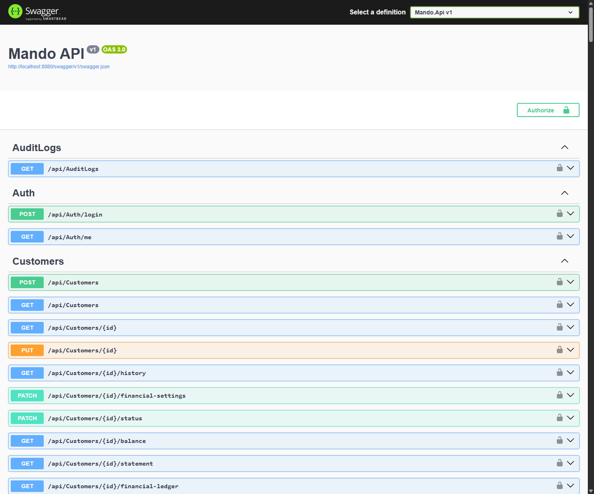
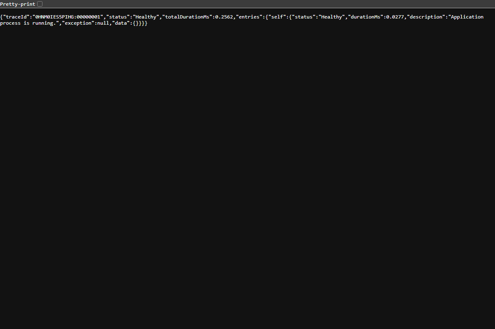
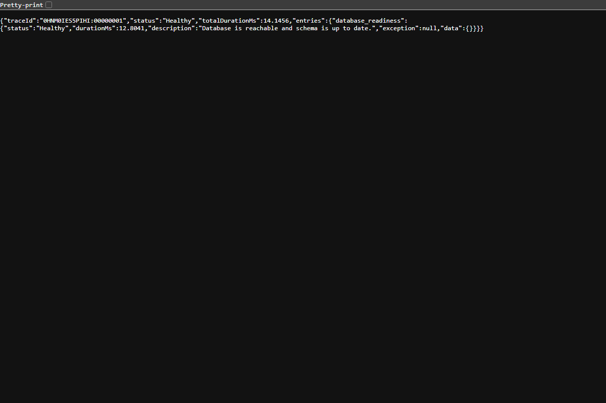
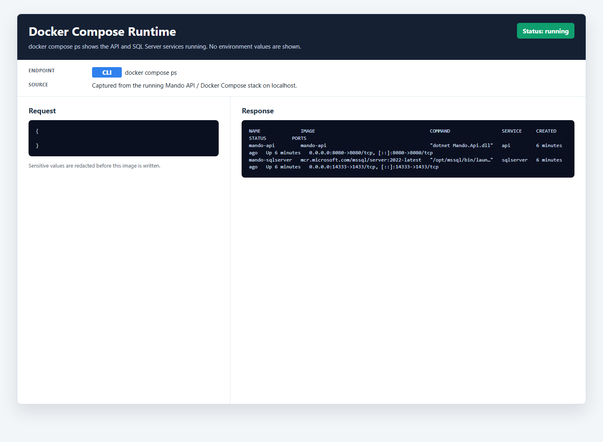
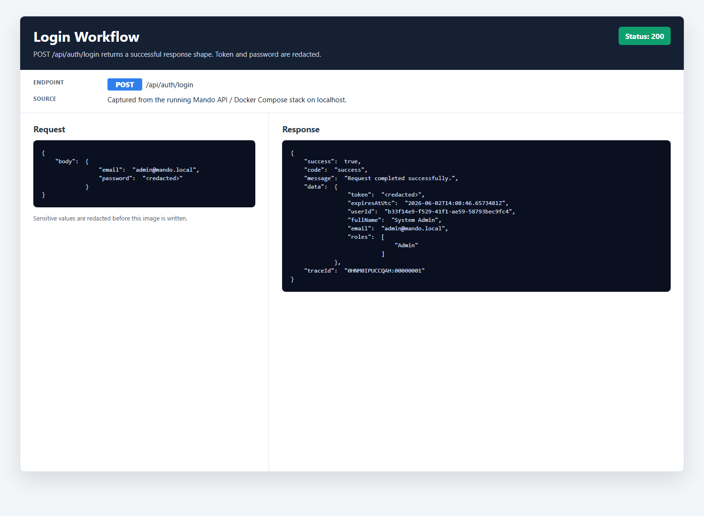
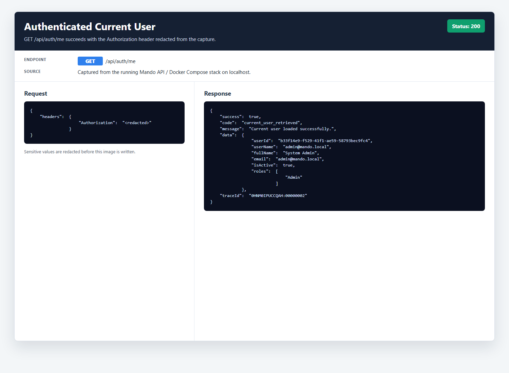
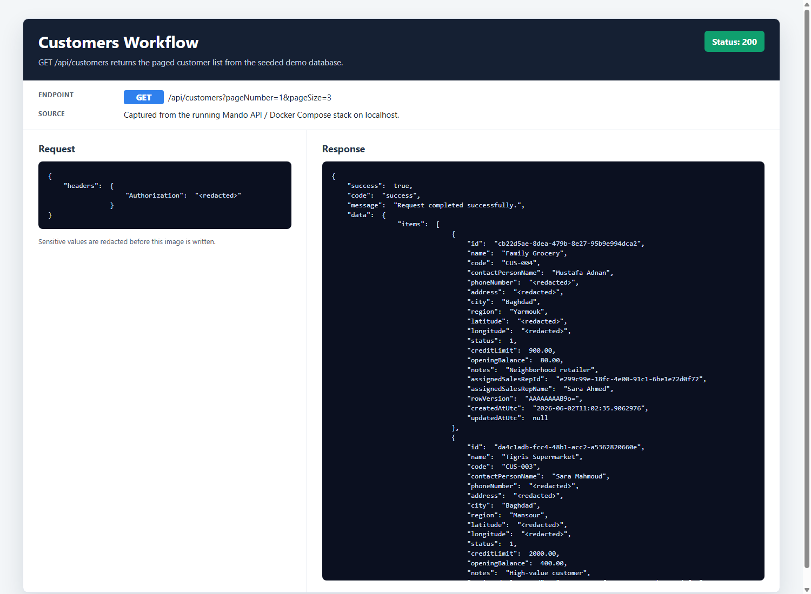
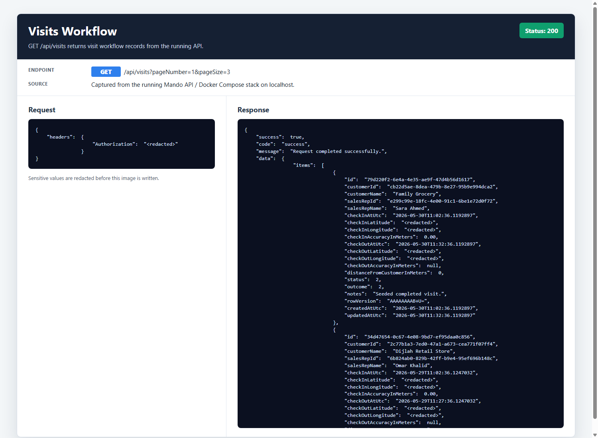
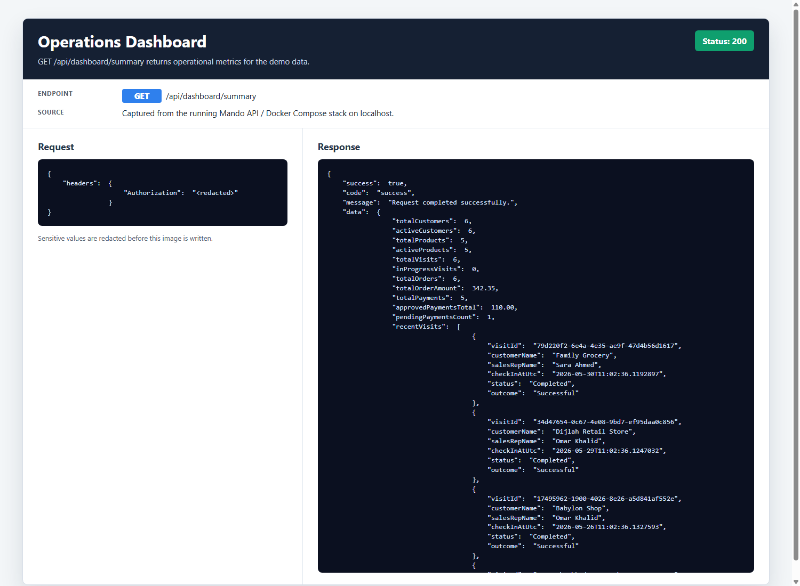

# Mando API

## Project Summary

Mando API is a production-style ASP.NET Core Web API for managing field sales operations end to end. It covers authentication, users, customers, visits, orders, payments, notifications, reports, operations dashboards, and audit logs.

The project is built to demonstrate backend engineering beyond tutorial CRUD. Its main value is workflow correctness around role-based access, SalesRep data scoping, GPS visit validation, payment review, customer balances, auditability, and reviewer-friendly DevOps.

## What The Project Solves

Mando models the lifecycle of a field sales platform:

- Sales reps authenticate and work within role-based permissions.
- Customers are assigned, managed, and reported with operational context.
- Visits are tracked as workflow events, including GPS validation and media support.
- Orders are created inside valid business boundaries.
- Payments go through controlled submission, approval, rejection, reverse, and void flows.
- Managers get visibility through dashboards, reports, alerts, notifications, and audit trails.

The code is intentionally organized so business rules, consistency, and traceability are visible during review.

## Core Capabilities

- Auth: login, JWT issuing, and current-user profile.
- Users: admin user creation, status changes, role changes, and sales-rep lookup.
- Customers: assignment, status lifecycle, credit settings, balance, statement, and ledger.
- Visits: GPS validation, active visit lifecycle, visit images, timeline, and attempt logs.
- Orders: order submission, cancellation rules, and credit-limit enforcement.
- Payments: submission, duplicate reference checks, approval, rejection, reverse, and void flows.
- Notifications: user-owned notification list, unread summary, and mark-read workflows.
- Reports and dashboards: sales, collections, debt, visit compliance, and operations KPIs.
- Audit logs: important workflow actions persisted for traceability.

## Tech Stack

- ASP.NET Core Web API on .NET 9.
- ASP.NET Core Identity with GUID users and roles.
- JWT bearer authentication.
- EF Core with SQL Server for local development and production-style runs.
- SQLite-backed integration tests through `WebApplicationFactory`.
- Swagger in Development.
- GitHub Actions CI.
- Dockerfile and Docker Compose for local review.
- Postman collection for API walkthroughs.

## Architecture Overview

```text
Mando.sln
|-- Mando.Api
|   |-- Controllers        HTTP endpoints and response mapping
|   |-- Services           Business workflows and query models
|   |-- Interfaces         Service contracts
|   |-- DTOs               Request and response contracts
|   |-- Entities           EF Core domain entities
|   |-- Data               AppDbContext, migrations, seeders
|   |-- Configurations     EF Core and options configuration
|   |-- Middleware         Exception, request logging, correlation ID
|   |-- Helpers            Cross-cutting helper utilities
|   |-- Extensions         Startup and pipeline composition
|   `-- Common             Shared base types and role constants
`-- Mando.Api.IntegrationTests
    |-- Auth
    |-- Contracts
    `-- Infrastructure
```

Request flow is intentionally simple:

```text
Controller -> Workflow/Query Service -> AppDbContext / Identity / helpers -> SQL Server
```

Controllers stay thin. Business rules live in services, with EF Core constraints and optimistic concurrency used where correctness matters.

The EF model includes:

- Unique customer and product codes.
- Unique order and payment numbers.
- Filtered uniqueness for one active visit per SalesRep.
- Filtered uniqueness for pending payment references per customer.
- Decimal precision for financial and GPS values.
- Restrictive delete behavior for operational records.
- RowVersion concurrency tokens on mutable workflow entities.
- Action-history tables for customer, product, user, visit, order, and payment transitions.

This repository emphasizes thin controllers, service-driven business logic, clear separation of concerns, consistent API response contracts, workflow-oriented design, EF Core discipline, production-aware startup behavior, integration-testable architecture, operational realism, and reviewer-friendly organization.

## Security Highlights

- JWT keys are required, must be at least 32 characters, and placeholder values are rejected.
- Tokens are rejected if the user is inactive, locked out, deleted, has a changed security stamp, or has changed roles.
- A fallback authorization policy requires authentication unless an endpoint explicitly allows anonymous access.
- Fixed-window rate limiting protects login and high-impact workflow mutations.
- SalesRep reads and writes are scoped in services so reps cannot access another rep's customers, visits, orders, payments, or notifications.
- Payment self-review is blocked.
- Visit media is stored in private local storage and served only through authorized API endpoints.
- Request logging avoids request bodies and sensitive credential payloads.

See [docs/security.md](docs/security.md) for the authorization matrix and remaining risks.

## Rate Limiting

Rate limits are configured through `RateLimiting:*` settings and can be overridden with environment variables.

| Policy | Endpoints | Default | Development/Docker default |
| --- | --- | --- | --- |
| `Login` | `POST /api/auth/login` | 10 requests / 60 seconds | 60 requests / 60 seconds |
| `SensitiveMutation` | Payment approve/reject/reverse/void, visit start/end | 30 requests / 60 seconds | 120 requests / 60 seconds |

429 responses use the standard error envelope with code `rate_limit_exceeded` and include `Retry-After` when the limiter can calculate it.

## Testing

Integration tests cover authentication, JWT rejection, role authorization, rate limiting, SalesRep data isolation, duplicate payment reference rejection, invalid order products, and GPS validation.

Run:

```powershell
dotnet restore Mando.sln
dotnet build Mando.sln
dotnet test Mando.sln
dotnet format Mando.sln --verify-no-changes
```

Current test project: `Mando.Api.IntegrationTests`.

GitHub Actions CI restores, builds, tests, and verifies formatting on pull requests and pushes to `main`.

## Local Development

Configure secrets first. The committed appsettings files intentionally do not contain real JWT keys or seed passwords.

Example with user-secrets:

```powershell
dotnet user-secrets set "Jwt:Key" "replace-with-at-least-32-random-characters" --project Mando.Api
dotnet user-secrets set "SeedAdmin:Password" "replace-with-a-local-password" --project Mando.Api
dotnet user-secrets set "SeedManager:Password" "replace-with-a-local-password" --project Mando.Api
dotnet user-secrets set "SeedSalesReps:0:Password" "replace-with-a-local-password" --project Mando.Api
```

Then:

```powershell
dotnet ef database update --project Mando.Api
dotnet run --project Mando.Api
```

Swagger is available in Development after the API starts.

## Docker Setup

Docker support is included for local review:

```powershell
copy .env.example .env
docker compose up --build
```

Replace every `REPLACE_WITH...` value in `.env` before running. The local `.env` file is ignored by Git and must not be committed.

Docker Compose starts SQL Server and the API, applies migrations, and seeds local review accounts when configured. It is intended for local portfolio review, not production deployment.

Required `.env` variables for Docker Compose:

| Variable | Purpose |
| --- | --- |
| `JWT_KEY` | Local JWT signing key, at least 32 characters |
| `MSSQL_SA_PASSWORD` | SQL Server SA password for the local container |
| `SEED_ADMIN_PASSWORD` | Local admin seed password |
| `SEED_MANAGER_PASSWORD` | Local manager seed password |
| `SEED_SALES_REP_0_PASSWORD` | Local SalesRep seed password |
| `SEED_SALES_REP_1_PASSWORD` | Local SalesRep seed password |
| `SEED_SALES_REP_2_PASSWORD` | Local SalesRep seed password |

Optional rate-limit and seed account display values are documented in [.env.example](.env.example).

## Screenshots

### Swagger



### Health Checks





### Docker Runtime



### Authentication Flow





### Field Sales Workflows






### Operations Dashboard



## Postman Collection

A starter collection is provided at [postman/Mando.Api.postman_collection.json](postman/Mando.Api.postman_collection.json). It includes login, current user, core list endpoints, and main workflow requests.

Run the login request first and store the returned JWT in the collection variable before calling authenticated endpoints.

## Documentation

Additional reviewer documentation lives in:

- [docs/security.md](docs/security.md)
- [docs/deployment.md](docs/deployment.md)
- [docs/screenshots/README.md](docs/screenshots/README.md)

## Limitations

- No refresh-token flow yet.
- No production-grade external file storage for visit images.
- Audit logs are application append-only, not cryptographically tamper-evident.
- Docker Compose is intended for local portfolio review, not production deployment.
- SQL Server is the production database target; SQLite is used only for integration-test speed and isolation.

## Future Improvements

- Add refresh tokens and token revocation management.
- Add SQL Server-backed concurrency stress tests for payment/order workflows.
- Add OpenAPI examples for common workflow requests.
- Add more end-to-end business workflow screenshots or a short demo video.

## Interview Explanation

Mando is meant to demonstrate backend judgment through a realistic field-sales domain. Field reps can only operate on assigned customers, visits gate order and payment creation, payments require manager or admin review, customer balances are derived from orders and approved payments, and important transitions are audited.

The code avoids a heavy architecture rewrite while still separating HTTP concerns from workflow and query services. That keeps business rules testable, reviewable, and close to the workflows they protect.
