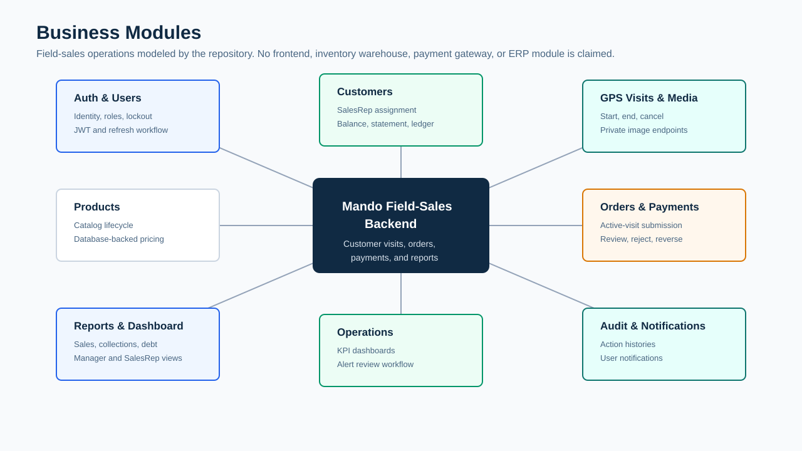
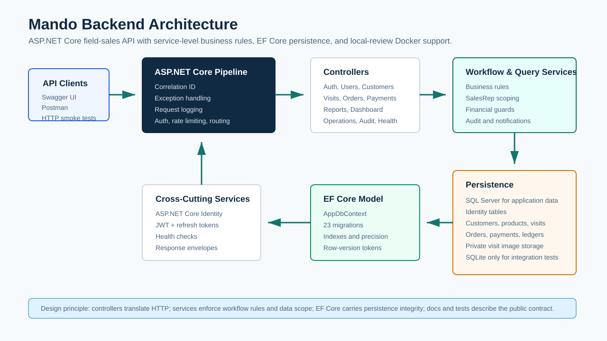
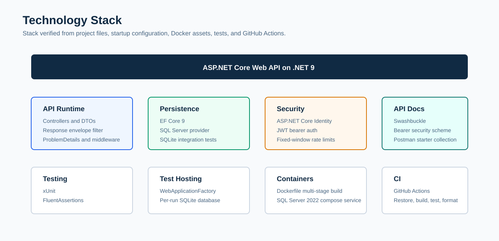
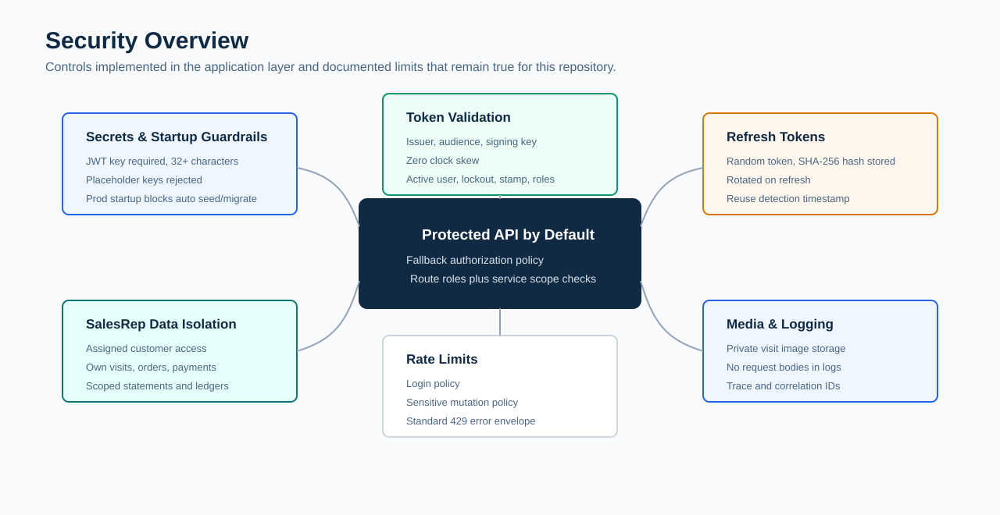
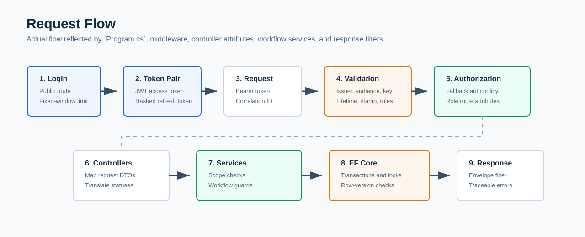
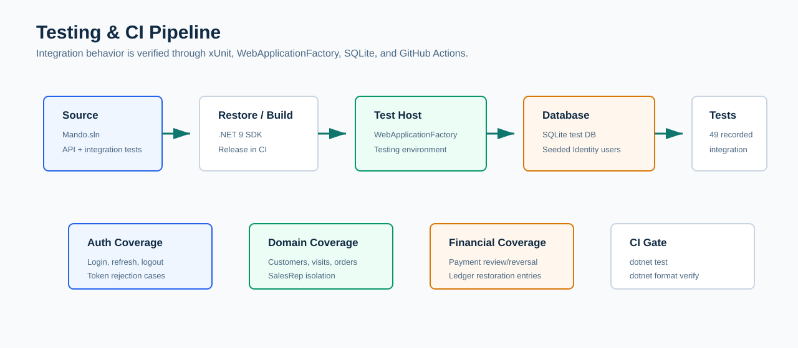
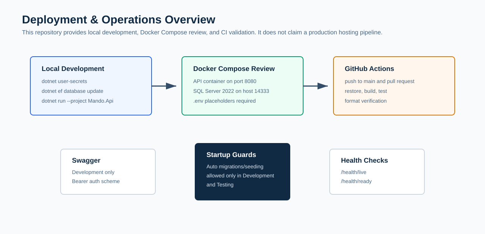

# Mando Backend

<div align="center">

**Enterprise-style field-sales backend for customer visits, orders, payment review, balances, reports, and SalesRep-scoped access control.**

Mando is a backend-only ASP.NET Core Web API built as a realistic field-sales portfolio system. It focuses on the kind of backend concerns that matter in client and interview discussions: authentication, authorization, service-level data isolation, financial workflow integrity, EF Core schema design, Docker-based local review, CI, documentation, and integration tests.


[Business Overview](#business-overview) | [Architecture](#architecture-overview) | [API](#api-documentation) | [Security](#security-features) | [Testing](#testing) | [Docker](#docker) | [Screenshots](#screenshots)

</div>

> [!IMPORTANT]
> This README describes only what exists in the repository. Mando is not presented as a full ERP, SaaS platform, frontend application, warehouse system, real payment gateway, or legal accounting product.

## Contents

- [Project Introduction](#project-introduction)
- [Why This Project Exists](#why-this-project-exists)
- [Business Overview](#business-overview)
- [Repository Highlights](#repository-highlights)
- [Key Features](#key-features)
- [Architecture Overview](#architecture-overview)
- [Project Structure](#project-structure)
- [Technology Stack](#technology-stack)
- [Security Features](#security-features)
- [Authentication & Authorization](#authentication--authorization)
- [Database & Financial Model](#database--financial-model)
- [API Documentation](#api-documentation)
- [Testing](#testing)
- [Docker](#docker)
- [CI/CD](#cicd)
- [Logging & Observability](#logging--observability)
- [Getting Started](#getting-started)
- [Configuration](#configuration)
- [Demo Data](#demo-data)
- [Screenshots](#screenshots)
- [Design Decisions](#design-decisions)
- [Production-Ready Capabilities](#production-ready-capabilities)
- [Limitations](#limitations)
- [Future Roadmap](#future-roadmap)
- [License](#license)
- [Author](#author)

## Project Introduction

Mando Backend models a field-sales operation where Sales Representatives visit assigned customers, submit orders, collect payments, and let Managers or Admins review operational and financial activity.

The project is intentionally backend-focused. The repository contains one API project and one integration test project, plus supporting documentation, Docker assets, screenshots, a Postman starter collection, and GitHub Actions CI.

## Why This Project Exists

Field-sales systems need more than CRUD. They need role-aware access, customer assignment boundaries, visit lifecycle rules, financial review, balance visibility, auditability, and operational reporting. Mando exists to demonstrate those backend concerns in a compact, reviewable codebase suitable for GitHub, CV discussions, and technical interviews.

## Business Overview

The core workflow is grounded in a realistic beverage/retail field-sales scenario:

1. Admin or Manager creates users, products, and customers.
2. Customers are assigned to SalesRep users.
3. A SalesRep starts a GPS-validated visit for an assigned active customer.
4. Orders are created inside active visits using product prices from the database.
5. Payments are submitted inside active visits and remain pending until review.
6. Manager or Admin users approve, reject, or reverse payments.
7. Customer balances, statements, ledgers, dashboards, reports, notifications, and audit logs reflect the workflow.



## Repository Highlights

| Area | What is in the repository |
| --- | --- |
| Solution shape | `Mando.Api` ASP.NET Core Web API and `Mando.Api.IntegrationTests` xUnit integration tests |
| Domain scope | Field-sales customers, visits, products, orders, payments, reports, dashboard, operations alerts, audit logs, notifications |
| Persistence | EF Core with SQL Server provider, Identity tables, private visit media metadata, and 23 non-designer migration files |
| Security | ASP.NET Core Identity, JWT bearer tokens, hashed rotating refresh tokens, role authorization, service-level SalesRep scoping |
| API docs | Swagger/OpenAPI in Development, bearer security scheme, Postman starter collection, HTTP smoke-test file |
| Tests | 49 documented integration tests using `WebApplicationFactory` and SQLite |
| Local review | Docker Compose with SQL Server 2022 and API container |
| CI | GitHub Actions restore, Release build, test, and format verification |

## Key Features

| Category | Capabilities |
| --- | --- |
| Identity & access | Admin, Manager, and SalesRep roles; unique email users; lockout policy; JWT access tokens; hashed refresh tokens; logout revocation |
| SalesRep isolation | SalesRep users can access assigned customers and their own visits, orders, payments, ledgers, statements, media, and dashboard views |
| Visit workflow | GPS start/end validation, one active visit per SalesRep, visit attempts, action history, media upload/list/content/delete APIs |
| Customer finance | Opening balance, credit limit, operational balance, statement, financial ledger, credit profile, financial-setting adjustments |
| Orders | Active-visit order creation, database product pricing, inactive product rejection, duplicate product rejection, credit-limit enforcement, cancellation workflow |
| Payments | Pending submission, duplicate normalized reference protection, approve/reject/reverse workflow, legacy `/void` alias, review queue, operations report |
| Operations | Management dashboards, KPI/range reports, operations alerts, alert review history, performance reports |
| Platform | Response envelopes, correlation IDs, request logging, health checks, Dockerfile, Docker Compose, CI workflow, documentation package |

## Architecture Overview



```text
API Client -> ASP.NET Core Middleware -> Controllers -> Workflow/Query Services -> EF Core / Identity -> SQL Server
```

| Layer | Responsibility | Evidence |
| --- | --- | --- |
| API pipeline | Correlation IDs, exception handling, Swagger in Development, forwarded headers, HTTPS redirection, request logging, auth, rate limiting | [ApplicationBuilderExtensions.cs](Mando.Api/Extensions/ApplicationBuilderExtensions.cs) |
| Service registration | Controllers, Swagger/OpenAPI, options validation, SQL Server DbContext, Identity, JWT bearer auth, authorization, health checks, scoped services | [ServiceCollectionExtensions.cs](Mando.Api/Extensions/ServiceCollectionExtensions.cs) |
| Controllers | Route-level authorization and HTTP response mapping | [Mando.Api/Controllers](Mando.Api/Controllers) |
| Services | Workflow rules, query shaping, SalesRep scoping, transactions, audit and notification side effects | [Mando.Api/Services](Mando.Api/Services) |
| Persistence | EF Core entities, configurations, migrations, Identity tables, SQL Server provider | [AppDbContext.cs](Mando.Api/Data/AppDbContext.cs) |
| Tests | In-memory test host with SQLite-backed integration tests | [Mando.Api.IntegrationTests](Mando.Api.IntegrationTests) |

## Project Structure

```text
Mando/
|-- Mando.Api/
|   |-- Controllers/              # Auth, users, customers, visits, orders, payments, reports, dashboard, operations
|   |-- Services/                 # Workflow/query services and cross-cutting services
|   |-- Interfaces/               # Service contracts
|   |-- Entities/                 # EF Core domain and Identity entities
|   |-- DTOs/                     # Request/response contracts
|   |-- Configurations/           # EF Core and options configuration
|   |-- Data/                     # AppDbContext, seeders, migrations
|   |-- Middleware/               # Correlation, request logging, exception handling
|   |-- Filters/                  # API response envelope filter
|   |-- Helpers/                  # Normalization, row-version, geo, response helpers
|   |-- Dockerfile
|   `-- SmokeTests.http
|-- Mando.Api.IntegrationTests/  # xUnit integration tests with WebApplicationFactory and SQLite
|-- docs/                        # Architecture, security, testing, deployment, workflow, and limitation docs
|-- docs/screenshots/            # Existing sanitized screenshots only
|-- docs/assets/graphics/        # README SVG diagrams
|-- postman/                     # Postman starter collection
|-- .github/workflows/ci.yml
|-- docker-compose.yml
|-- .env.example
`-- Mando.sln
```

## Technology Stack



| Concern | Technology |
| --- | --- |
| Runtime | .NET 9, ASP.NET Core Web API |
| API documentation | Swashbuckle / Swagger UI, OpenAPI v1 document |
| Authentication | ASP.NET Core Identity, JWT Bearer authentication |
| Authorization | Role attributes, fallback authorization policy, service-level scoping |
| Database | EF Core 9 with SQL Server provider |
| Test database | SQLite through `WebApplicationFactory` |
| Testing | xUnit, FluentAssertions, Microsoft.AspNetCore.Mvc.Testing, coverlet collector package |
| Containers | Multi-stage .NET Dockerfile, Docker Compose |
| CI | GitHub Actions on `push` to `main` and pull requests |

## Security Features



| Control | Implementation |
| --- | --- |
| Default protected API | Fallback authorization policy requires authentication unless a route explicitly allows anonymous access |
| Identity policy | Unique emails, password requirements, lockout after failed attempts |
| JWT validation | Issuer, audience, signing key, lifetime, zero clock skew, active user state, lockout state, security stamp, current role set |
| Refresh tokens | Random refresh tokens stored as SHA-256 hashes, rotated on refresh, revoked on logout, reuse detection timestamp |
| Generic login errors | Public login responses do not reveal whether the user is missing, inactive, locked out, or using a wrong password |
| Rate limiting | Fixed-window policies for login and selected sensitive workflow mutations |
| SalesRep scoping | Enforced inside services for customer, visit, order, payment, ledger, statement, media, and dashboard access |
| Private media | Visit images are stored under private application storage and served through authorized API endpoints |
| Safe logging | Request logging records route metadata and user identifiers, not request bodies or credential payloads |
| Startup guardrails | Automatic migrations and seeding are blocked outside Development and Testing |

More detail: [docs/security-model.md](docs/security-model.md), [docs/security.md](docs/security.md), and [docs/authorization-matrix.md](docs/authorization-matrix.md).

## Authentication & Authorization

| Role | Intended access |
| --- | --- |
| Admin | User administration, customer/product management, financial settings, management reporting, payment review, audit logs |
| Manager | Customer/product management, payment review, dashboards, operations, reporting, audit log review |
| SalesRep | Assigned customers, own visits, own orders, own payments, own dashboard, scoped customer financial views |



Authentication routes:

| Route | Access | Notes |
| --- | --- | --- |
| `POST /api/auth/login` | Anonymous | Rate-limited; returns access token and refresh token on success |
| `POST /api/auth/refresh` | Anonymous | Rotates valid refresh tokens |
| `POST /api/auth/logout` | Authenticated | Revokes the submitted refresh token |
| `GET /api/auth/me` | Authenticated | Returns the current authenticated user profile |

## Database & Financial Model

Mando uses SQL Server for the application database and EF Core migrations under [Mando.Api/Data/Migrations](Mando.Api/Data/Migrations). Integration tests replace SQL Server with SQLite for isolated test execution.

| Data area | Tables/entities represented |
| --- | --- |
| Identity | ASP.NET Core Identity users, roles, claims, tokens, logins |
| Core domain | Customers, products, visits, visit images, visit attempts |
| Commercial workflow | Orders, order items, payments |
| Financial review | Customer balances derived from orders and approved payments, financial ledger, statements, credit profile |
| Operations | Notifications, operations alert reviews, audit logs, action-history tables |
| Auth sessions | Refresh tokens with hash, expiry, revocation, replacement, and reuse-detection fields |

Customer balance is operational and derived:

```text
opening balance + non-cancelled order totals - currently approved payments
```

Financial integrity controls include decimal precision, unique customer/product/order/payment codes or numbers, normalized pending payment reference uniqueness, row-version concurrency tokens, restrictive deletes for financial relationships, and service-level financial locks around sensitive workflows.

More detail: [docs/financial-model.md](docs/financial-model.md).

## API Documentation

Swagger is enabled only in Development. The OpenAPI configuration defines `Mando API` version `v1` and includes a bearer token security definition.

| Area | Example routes |
| --- | --- |
| Auth | `POST /api/auth/login`, `POST /api/auth/refresh`, `GET /api/auth/me` |
| Users | `GET /api/users`, `POST /api/users`, `PATCH /api/users/{id}/role` |
| Customers | `GET /api/customers`, `POST /api/customers`, `GET /api/customers/{id}/statement` |
| Visits | `POST /api/visits/start`, `POST /api/visits/{id}/end`, `GET /api/visits/{id}/timeline` |
| Visit media | `POST /api/visits/{id}/images`, `GET /api/visits/images/{imageId}/content` |
| Products | `GET /api/products`, `POST /api/products`, `PATCH /api/products/{id}/status` |
| Orders | `POST /api/orders`, `GET /api/orders`, `PATCH /api/orders/{id}/cancel` |
| Payments | `POST /api/payments`, `PATCH /api/payments/{id}/approve`, `PATCH /api/payments/{id}/reverse` |
| Reports | `GET /api/reports/*`, `GET /api/reports/performance/*` |
| Operations | `GET /api/operations/dashboard/today`, `GET /api/operations/alerts` |
| Health | `GET /health/live`, `GET /health/ready` |

Supporting API assets:

| Asset | Purpose |
| --- | --- |
| [docs/api-overview.md](docs/api-overview.md) | Route-area summary |
| [postman/Mando.Api.postman_collection.json](postman/Mando.Api.postman_collection.json) | Starter Postman collection for local review |
| [docs/postman-collection-plan.md](docs/postman-collection-plan.md) | Manual Postman revalidation plan |
| [Mando.Api/SmokeTests.http](Mando.Api/SmokeTests.http) | HTTP client smoke-test workflow |

## Testing



The integration tests use `WebApplicationFactory<Program>`, the Testing environment, a per-run SQLite database, and seeded Identity users.

| Coverage area | Examples |
| --- | --- |
| Authentication | Login failures, current user, refresh-token issue/rotation/reuse/expiry/logout, stale token rejection |
| Authorization | Role restrictions, protected endpoints, SalesRep denial for management reports |
| SalesRep isolation | Cross-rep customer, visit, order, payment, ledger, and dashboard access boundaries |
| Visit workflow | GPS validation, active visit rule, invalid completion outcome, double-end rejection |
| Orders | Database pricing, duplicate product lines, inactive products, credit-limit enforcement |
| Payments | Normalized references, approval, rejection, reversal, legacy void alias, ledger reversal movements |
| Operations | Dashboard/report access checks and rate-limit behavior |

Run locally:

```powershell
dotnet restore Mando.sln
dotnet build Mando.sln
dotnet test Mando.sln
```

Current documented test count: **49 integration tests**. Remaining test gaps are documented in [docs/testing-strategy.md](docs/testing-strategy.md) and [docs/known-limitations.md](docs/known-limitations.md).

## Docker



Docker assets are provided for local review:

| Asset | Behavior |
| --- | --- |
| [Mando.Api/Dockerfile](Mando.Api/Dockerfile) | Multi-stage .NET 9 build and ASP.NET runtime image exposing port `8080` |
| [docker-compose.yml](docker-compose.yml) | Runs `mando-api` with SQL Server 2022, maps API to `8080`, maps SQL Server to host `14333` |
| [.env.example](.env.example) | Placeholder values for JWT key, SQL Server password, seed passwords, rate limits, and demo settings |

Typical local review flow:

```powershell
copy .env.example .env
docker compose up --build
docker compose ps
docker compose logs
docker compose down
```

> [!WARNING]
> Docker Compose is documented for local review. It is not a production deployment recipe.

## CI/CD

CI is defined in [.github/workflows/ci.yml](.github/workflows/ci.yml).

| Trigger | Runner | Steps |
| --- | --- | --- |
| Pull request | `ubuntu-latest` | Checkout, setup .NET 9, restore, Release build, test, format check |
| Push to `main` | `ubuntu-latest` | Checkout, setup .NET 9, restore, Release build, test, format check |

The workflow verifies formatting with:

```powershell
dotnet format Mando.sln --verify-no-changes --no-restore --verbosity minimal
```

## Logging & Observability

| Capability | Implementation |
| --- | --- |
| Correlation ID | `X-Correlation-ID` request/response header normalization, stored in `HttpContext.TraceIdentifier` |
| Request logs | Method, path, status code, elapsed time, trace ID, user ID, remote IP, query parameter count, content metadata, protocol, user agent |
| Noise reduction | Health and Swagger request logs are debug-level when successful |
| Global exceptions | Structured error mapping for concurrency conflicts, duplicate resources, transient database failures, forbidden access, cancellations, and unexpected errors |
| Health checks | `/health/live` for process liveness, `/health/ready` for database connectivity and pending migration detection |
| Response shape | Success/error envelopes include traceability metadata |

## Getting Started

### Prerequisites

| Requirement | Notes |
| --- | --- |
| .NET SDK | .NET 9 SDK |
| Database | SQL Server LocalDB, SQL Server Developer Edition, or the SQL Server Docker Compose service |
| EF Core CLI | Required when applying migrations manually with `dotnet ef` |
| Docker Desktop | Optional, only for Docker Compose review |

### Local API Run

```powershell
dotnet restore Mando.sln
dotnet user-secrets set "Jwt:Key" "replace-with-at-least-32-random-characters" --project Mando.Api
dotnet ef database update --project Mando.Api
dotnet run --project Mando.Api
```

Development launch settings expose:

| Profile | URL |
| --- | --- |
| HTTP | `http://localhost:5295` |
| HTTPS | `https://localhost:7203` and `http://localhost:5295` |

Swagger is available in Development at `/swagger`.

### Optional Seed Users

Set seed passwords before enabling startup seeding:

```powershell
dotnet user-secrets set "SeedAdmin:Password" "replace-with-a-local-password" --project Mando.Api
dotnet user-secrets set "SeedManager:Password" "replace-with-a-local-password" --project Mando.Api
dotnet user-secrets set "SeedSalesReps:0:Password" "replace-with-a-local-password" --project Mando.Api
dotnet user-secrets set "SeedSalesReps:1:Password" "replace-with-a-local-password" --project Mando.Api
dotnet user-secrets set "SeedSalesReps:2:Password" "replace-with-a-local-password" --project Mando.Api
dotnet user-secrets set "Startup:RunSeedOnStartup" "true" --project Mando.Api
```

Set `SeedData:Enabled=true` only when you also want demo products, customers, visits, orders, and payments.

## Configuration

| Key | Purpose |
| --- | --- |
| `ConnectionStrings:DefaultConnection` | SQL Server database connection |
| `Jwt:Key` | HMAC signing key; required and at least 32 characters |
| `Jwt:Issuer` | Expected token issuer |
| `Jwt:Audience` | Expected token audience |
| `Jwt:ExpiryMinutes` | Access-token lifetime; validated range is 1 to 1440 minutes |
| `Jwt:RefreshTokenExpiryDays` | Refresh-token lifetime; validated range is 1 to 90 days |
| `RateLimiting:Login:*` | Login fixed-window permit limit and window |
| `RateLimiting:SensitiveMutation:*` | Fixed-window throttling for visit lifecycle and payment review mutations |
| `Gps:*` | Visit start/end distance and accuracy thresholds |
| `ForwardedHeaders:*` | Optional reverse-proxy forwarding configuration |
| `Startup:ApplyMigrationsOnStartup` | Applies migrations only when allowed by environment guard |
| `Startup:RunSeedOnStartup` | Runs seed users/data only when allowed by environment guard |
| `SeedAdmin:*`, `SeedManager:*`, `SeedSalesReps:*` | Development/testing seed accounts when seeding is enabled |
| `SeedData:Enabled` | Enables optional demo products, customers, visits, orders, and payments |

Production-like runs should provide secrets through environment variables, user-secrets, or a secret manager. Real JWT keys, SQL passwords, and seed passwords are intentionally not committed.

## Demo Data

When seeding is enabled in Development or Testing:

| Seed area | Data created |
| --- | --- |
| Roles | `Admin`, `Manager`, `SalesRep` |
| Users | Configured Admin, Manager, and three SalesRep accounts |
| Products | 12 beverage products, including one inactive demo product |
| Customers | 10 Baghdad-area demo customers assigned across SalesRep users |
| Workflow data | Completed visits, orders, and payments with approved, pending, rejected, and reversed examples |

Suggested local-only emails are configured in Development settings and `.env.example`; passwords are not committed.

| Role | Email |
| --- | --- |
| Admin | `admin@mando.local` |
| Manager | `manager@mando.local` |
| SalesRep | `ali@mando.local` |
| SalesRep | `sara@mando.local` |
| SalesRep | `omar@mando.local` |

More detail: [docs/demo-scenario.md](docs/demo-scenario.md).

## Screenshots

Only existing repository screenshots are used here. No generated or placeholder screenshots were added for this README.

| Swagger | Docker |
| --- | --- |
|  |  |

| Health live | Health ready |
| --- | --- |
|  |  |

| Login | Current user |
| --- | --- |
|  |  |

| Customers | Visits |
| --- | --- |
|  |  |

| Payments | Dashboard |
| --- | --- |
|  |  |

Screenshot rules and replacement notes: [docs/screenshots/README.md](docs/screenshots/README.md).

## Design Decisions

| Decision | Reason |
| --- | --- |
| Backend-only scope | Keeps the project focused on API, security, persistence, workflows, and testing rather than frontend breadth |
| Service-level scoping | Prevents SalesRep access rules from depending only on controller attributes |
| Derived balances | Keeps current balance based on opening balance, non-cancelled orders, and currently approved payments |
| Database product prices | Prevents clients from submitting trusted order prices |
| Normalized payment references | Blocks duplicate pending non-cash references despite casing, spaces, or punctuation differences |
| Row-version concurrency | Protects lifecycle mutations for customers, visits, orders, products, and payments |
| Private visit media | Keeps images out of public static serving and requires authorized API access |
| Honest limitations | Separates portfolio-ready backend capabilities from production hosting, ERP, SaaS, and accounting claims |

## Production-Ready Capabilities

Mando includes several production-oriented backend capabilities:

| Capability | Present in repository |
| --- | --- |
| Secure auth foundation | Identity, JWT bearer validation, hashed refresh tokens, lockout, stale-token checks |
| Authorization model | Role-based routes plus service-level scoping for SalesRep data isolation |
| Persistence discipline | SQL Server provider, EF Core migrations, precision, indexes, constraints, row-version concurrency |
| Operational health | Liveness/readiness endpoints with database readiness and pending migration detection |
| Observability | Correlation IDs, structured request logging, global exception mapping |
| Local container review | Dockerfile and Docker Compose for API plus SQL Server |
| CI quality gate | Restore, build, test, and format verification on GitHub Actions |
| Documentation | Security model, authorization matrix, financial model, workflows, testing strategy, deployment notes, known limitations |

> [!NOTE]
> These are production-oriented capabilities inside the codebase. Docker Compose remains a local-review setup, and production hosting, secret management, infrastructure, monitoring, and release automation are not included.

## Limitations

Real limitations documented by the repository:

- Test coverage was expanded to 49 integration tests, but the previous 90 to 130 test target was not reached.
- Docker Compose is for local review and is not a production deployment recipe.
- SQL Server migration execution should be verified on the target developer machine before publication.
- Visit images use local private storage, not cloud object storage.
- Audit logs are application-level records and are not cryptographically tamper-evident.
- The repository has no frontend, mobile app, real payment gateway, SaaS tenancy, ERP inventory, warehouse module, or external accounting integration.
- The Postman collection is a starter collection and should be revalidated against the final running API after route changes.
- Screenshots are existing local assets; this README did not add new runtime screenshots.

More detail: [docs/known-limitations.md](docs/known-limitations.md).

## Future Roadmap

Grounded future improvements already reflected in project documentation:

- Expand tests toward the 90 to 130 meaningful integration-test target.
- Add more SQL Server-backed constraint, migration, and concurrency tests.
- Add report result-shape and pagination tests.
- Add visit media upload/content authorization tests.
- Revalidate and expand the Postman collection after API changes.
- Capture fresh screenshots from a clean local run when publishing a refreshed release.
- Consider optional product stock lite only if it remains within the field-sales scope.

## License

This project is licensed under the [MIT License](LICENSE).

## Author

Mando Backend is maintained as a backend portfolio project. The repository license identifies **Mando Backend** as the 2026 copyright holder.
